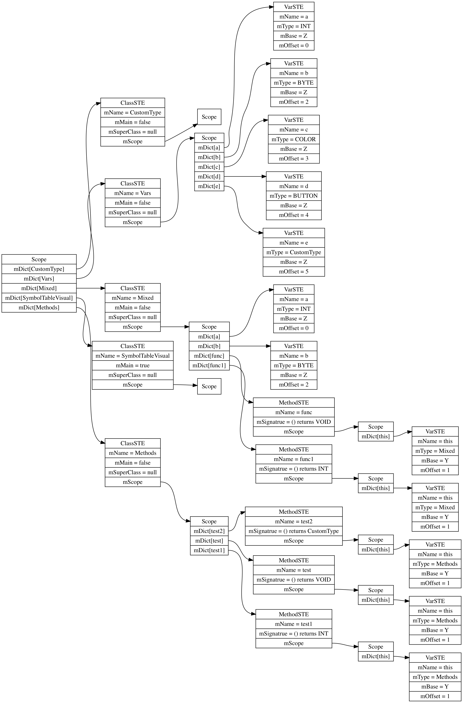

# PA5

Dear Mary and TA,

I think PA5 is kind of simple comparing to PA3 and PA4, I just need to add a few things, such as:

* augment grammar in `mj.cup`
* support custom class type, and add type checking for them
* add member variables to class, calculate the size of class, and `new` class with the correct size
* add base `Z` and offset of member variables
* add assign statement and do type checking for it
* add class comparison, basically just compare with the address of class
* edit prologue and epilogue for method call, so they can make space and restore space correctly for both parameters and locals
* refactor the code 

All the test files are under `PA5/TestCasesMeggy/WorkingTestCases`:
```
WorkingTestCases
├── PA5PaddleBall.java
├── PA5RubricTest.java
├── PA5RunningExample.java
├── PA5Test1.java
├── PA5Test2.java
├── PA5Test3.java
├── PA5movedot.java
└── PA5obj.java

0 directories, 8 files
```

Also, I fixed the function of visulize symbol table, you can find `SymbolTableVisual.java` under `PA5`, and the compiler will generate dot file for its symbol table automatically. Note that the visualization is not implemented using a visitor.

