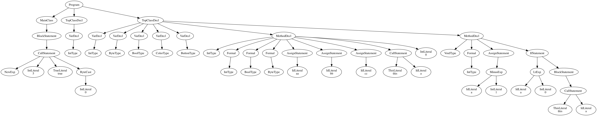
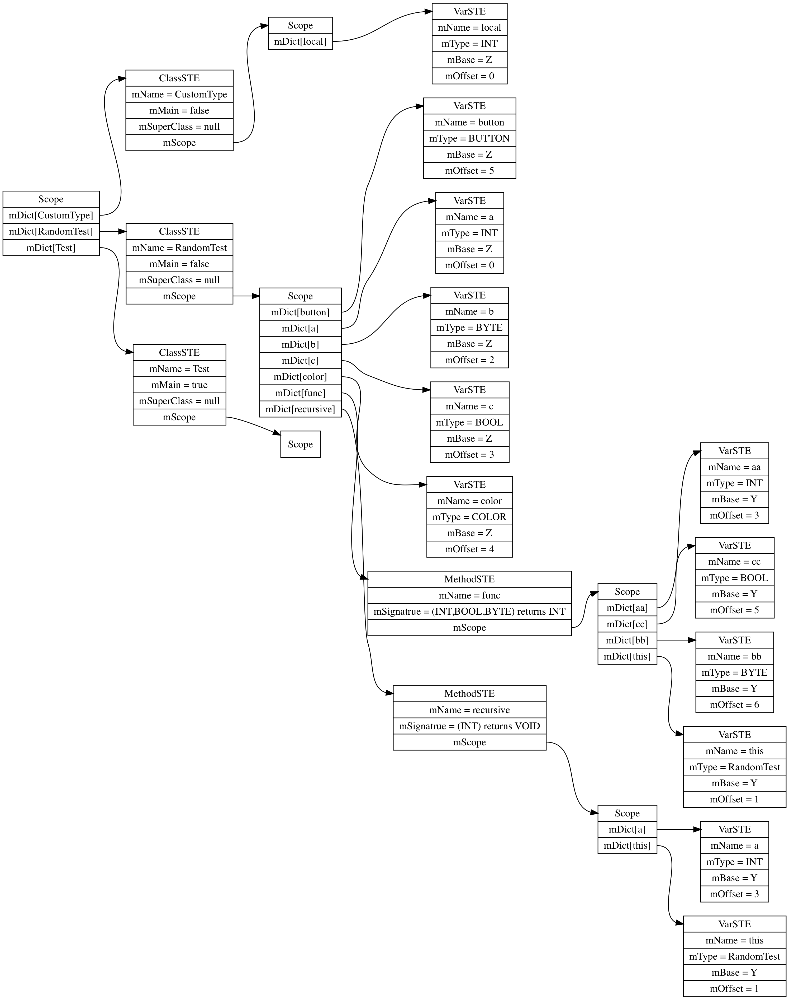

# MeggyJava Compiler

This is the course work for UVa CS6620, Compiler.

[MeggyJava](https://www.eecis.udel.edu/~pollock/672/f15/MeggyJavaInfo/BNFforMeggyJava.html) is a programming language based on [MiniJava](http://www.cambridge.org/resources/052182060X/MCIIJ2e/grammar.html). It can be used to programm [Meggy Jr RGB](https://shop.evilmadscientist.com/productsmenu/100), which is a handheld platform for developing your own pixel-scale video games.

This complier will translate MeggyJava code into AVR Assembly, which can be run on the simulator and Meggy Jr RGB device. Also, it will generate a `dot` file to visualize its AST and Symbol Table.

## Usage

```bash
// using only lexer
java -jar MJPA2.jar example.java
// using compiler
java -jar MJ.jar example.java
// using simulator
java -jar MJSIM.jar -b -f example.java.s
// visualize AST
dot example.ast.dot -Tpng -o example.ast.png
// visualize Symbol Table
dot example.ST.dot -Tpng -o example.ST.png
```

For example, [Test.java](./sample/Test.java) has the following AST and Symbol Table:


